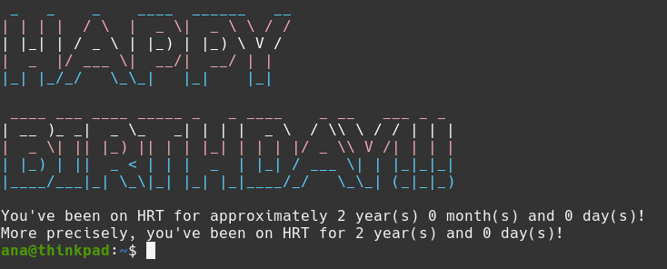

# HRT-Birthday

Script that will tell you:

- How many days it's been since you started HRT
- Whether it's your HRT birthday and if so, will print out a pretty message :)

## Installation

- Clone this repository
- Ensure this script is set as executable
- Set the `START_DATE` parameter to your own hrt birthday
- Copy or sym link this script to somewhere in your PATH, such as `~/.local/bin`
- Call it from the command line with `hrt`
- To get a birthday message when opening bash, put `hrt -b` in your `~/.bashrc`
  - You will need to install [pridecat](https://github.com/lunasorcery/pridecat) and [figlet](https://github.com/cmatsuoka/figlet) for formatting

## NuShell Script

I've also decided to write a [nushell](https://www.nushell.sh/) script to do the same thing.

After performing similar steps as above, you can run it with `hrt.nu`.

To get a birthday message when starting `nu`, put `hrt.nu -b` in your `$nu.config-path`.
